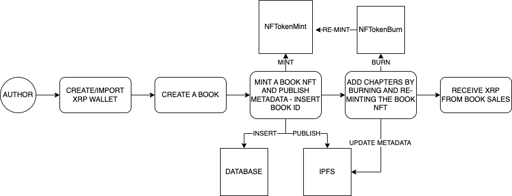

**[Live Demo](https://ripples-of-knowledge.vercel.app/)**

## Getting Started

### 1. Clone the Repo:

```bash
git clone https://github.com/tunahandanis/ripples-of-knowledge.git
```

### 2. Install Dependencies:

```bash
npm install
```

### 3. Run the Development Environment:

```bash
npm run dev
```

Check out [http://localhost:3000](http://localhost:3000) on the browser and you're good to go!

---

## Inspiration

Companies such as Webnovel and Royal Road provide an environment for authors to share their work and gain some support while providing its users access to many good web novels. However, they are highly centralized; and in many cases, provide unfair circumstances for its authors. Plagiarism is also abundant in the industry due to the nature of the work. So I developed the "Ripples of Knowledge" to address these issues, using the power of the XRP Ledger.

## What it does

Ripples of Knowledge is a decentralized platform that lets authors publish their novels, have their readers see their work and support them if they wish to.

## How we built it



---


The web application is built with **Next.js**, backend with **Node**, Web3 development with **xrpl.js**, IPFS pinning with Pinata, and version control with **Git**.

## Challenges we ran into

As a developer very new to the blockchain development, I struggled a lot with all the unfamiliar configurations.

## Accomplishments that we're proud of

I'm very inexperienced in the blockchain development, it was a tough process; but I managed to build most of what I wanted, for which I'm content.

## What we learned

A lot of stuff on blockchain development!

## What's next for Ripples of Knowledge

- Implementing IPNS to get rid of the unnecessary gas fees associated with burning and re-minting book NFTs
- More flexible configurations, such as free chapter count
- Option to buy a specific amount of chapters instead of the whole book for much smaller price
